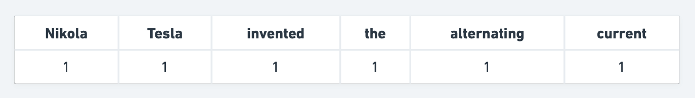
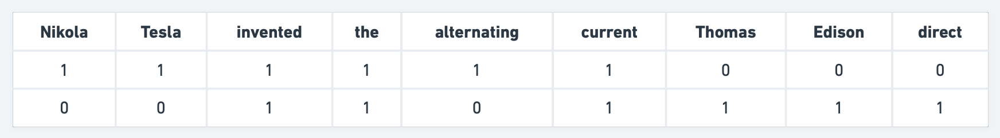
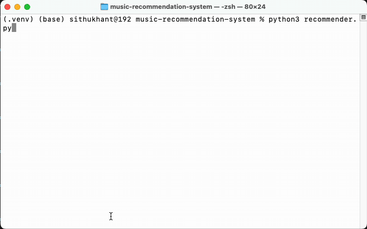

# Music recommendation system

Code for Music recommendation system with Scikit-Learn blog. To read the full blog post about this, [read here](https://sithukhantai.medium.com/music-recommendation-system-with-scikit-learn-30f4d07c60b3)

If you are a user of any social media or any websites, I am sure you could be caught in the tracking net of one of them. Do you wonder how those systems are made? I mean, the recommendation system can make you obsess with your time. Or if you are curious about how recommendation systems are made, let’s create a simple top ten music recommendation system with Scikit-Learn.

There are three types of systems. Collaborative filtering and Content-based filtering are the two main systems, and Hybrid recommendation is the combination of those two systems. Most recommendation systems now use the hybrid one.

## Data

https://www.kaggle.com/datasets/rakkesharv/spotify-top-10000-streamed-songs

## Requirements

* Pandas
* Scikit-Learn

## CountVectorizer

CountVectorizer converts a collection of documents into a matrix of word counts. Let’s see how CountVectorizer works.

Here is a sentence: “Nikola Tesla invented the alternating current”. CountVectorizer will convert that sentence into something like this:

You can see that CountVectorizer counts the word frequency. If there are more than two `the` in that sentence, you will see `2` instead of `1`.

To be clear, let’s add one more sentence to that same vector. “Thomas Edison invented the direct current”

It is saying it will create a new column with a word if the new inserted word in the new sentence doesn’t exist. The limitation of CountVectorizer is that it also counts less important words like a , the , and . But CountVectorizer is suitable for our project. We don’t need to use it in complete sentencesPython codes

## Final result

## Contact me

If you have any problem and want to contact, [mail me](mailto:sithukhantai@gmail.com)
